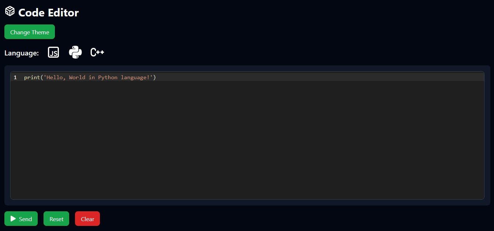

# Online Code Editor


Este proyecto es un editor en línea que permite compilar y ejecutar código en JavaScript, Python y C. El editor está construido utilizando FastAPI para el backend y una aplicación React para el frontend. Ambos componentes están contenerizados con Docker y se pueden ejecutar con Docker Compose.


## Estructura del Proyecto

Esta es la estructura de la aplicacion, se citan los eleementos y componentes que considero relevantes.

```plaintext
.
├── .dockerignore                  # Archivos y directorios ignorados por Docker
├── compose.yaml                   # Archivo de configuración para Docker Compose
├── media                          # Carpeta con los archivos para el README (iconos, imagenes, etc)
├── fastApi/                       # Carpeta del backend con FastAPI
│   ├── app/                       # Directorio de la aplicación FastAPI
│   │   └── main.py                # Archivo principal de la API
│   ├── dockerfile                 # Dockerfile para construir la imagen del backend
│   ├── requirements.txt           # Dependencias de Python para FastAPI
│   └── venv/                      # Entorno virtual de Python
├── sandbox/                       # Carpeta del frontend con React
│   ├── .dockerignore              # Archivos y directorios ignorados por Docker
│   ├── dockerfile                 # Dockerfile para construir la imagen del frontend
│   ├── package.json               # Archivo de configuración de Node.js para el frontend
│   ├── src/                       # Código fuente de la aplicación React
│   │   ├── App.tsx                # Componente principal de React
│   │   ├── components/            # Carpeta de componentes de React
│   │   │   └── Editor.tsx         # Componente del editor de código
│   │   └── main.tsx               # Punto de entrada de la aplicación React
└── README.md                      # Documentación del proyecto
```


## Requisitos

- Docker: [Descargar Docker](https://www.docker.com/products/docker-desktop)
- Docker Compose: [Descargar Docker Compose](https://docs.docker.com/compose/install/)

## Instrucciones de Instalación

1. Clona el repositorio:

    ```sh
    git clone git@github.com:Angelo-Eyama/code_editor
    cd code_editor
    ```

2. Construye y levanta los contenedores usando Docker Compose:

    ```sh
    docker-compose up --build
    ```

3. Accede a la aplicación en tu navegador web en `http://localhost:5173`.

## Descripción de los Directorios

- `fastApi/`: Contiene el backend construido con FastAPI.
  - `app/main.py`: Archivo principal de la aplicación FastAPI.
  - `dockerfile`: Dockerfile para construir la imagen del backend.
  - `requirements.txt`: Dependencias de Python para el backend.
  - `venv/`: Entorno virtual de Python.

- `sandbox/`: Contiene el frontend construido con React.
  - `src/`: Código fuente de la aplicación React.
    - `App.tsx`: Componente principal de la aplicación.
    - `components/Editor.tsx`: Componente del editor de código.
  - `dockerfile`: Dockerfile para construir la imagen del frontend.
  - `package.json`: Dependencias de Node.js para el frontend.

## Uso

El editor en línea permite escribir, compilar y ejecutar código en los siguientes lenguajes:

- JavaScript
- Python
- C

Puedes seleccionar el lenguaje, escribir tu código y ejecutarlo directamente desde el editor.

## Contribuciones

Las contribuciones son bienvenidas. Por favor, abre un issue o un pull request para discutir cualquier cambio que te gustaría hacer.

## Licencia

Este proyecto está licenciado bajo la Licencia MIT. Consulta el archivo `LICENSE` para más detalles.